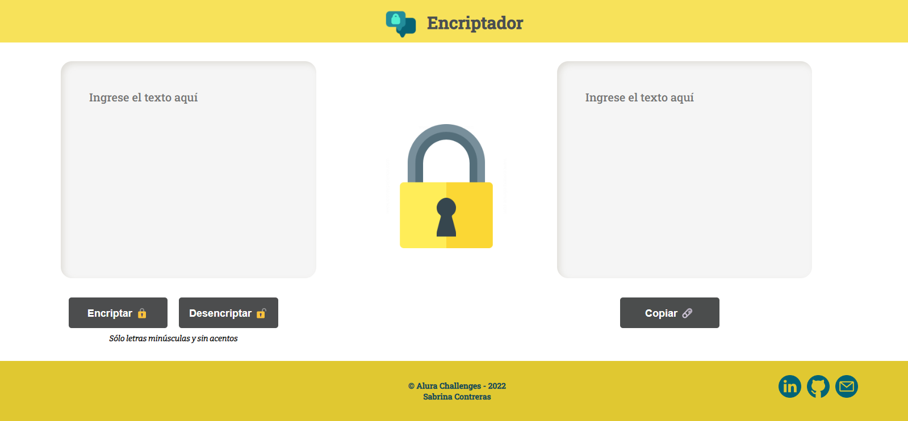

# Challenge ONE |Encriptador de Texto
### Lógica de programación

     

## Reglas de encriptación
          La letra "e" es convertida para "enter"
          La letra "i" es convertida para "imes"
          La letra "a" es convertida para "ai"
          La letra "o" es convertida para "ober"
          La letra "u" es convertida para "ufat" 
